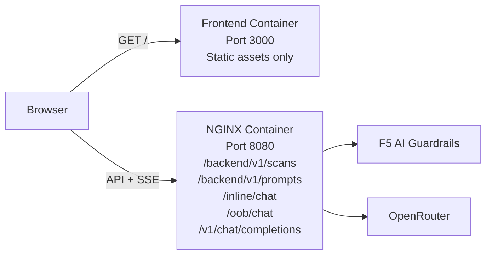

# F5 AI Guardrails Demo

Interactive demo platform for **F5 AI Guardrails** — an AI runtime security solution that inspects, evaluates, and optionally blocks LLM prompts and responses before they reach end users. This project demonstrates how NGINX can serve as a front-end proxy to orchestrate and visualize the guardrail inspection flow in real time.

## What It Does

The demo supports two operation modes:

- **Inline Mode** — the prompt is sent through the Guardrails inspection flow. NGINX proxies the request to Guardrails, which evaluates the prompt and routes it to the LLM. The UI displays a real-time Server-Sent Events (SSE) animation showing each stage of the flow: request → Guardrails → LLM → response.
- **Out-of-Band (OOB) Mode** — the prompt is pre-scanned by Guardrails first. If allowed, NGINX forwards it directly to the LLM. The UI visualizes the scan result and the LLM response separately.

Both modes show Guardrails scanner results, risk scores, and the full request/response payload in a single-page UI.

## Architecture

The platform runs as two containers:

| Container | Role | Port |
|-----------|------|------|
| **Frontend** | Static file server (Node.js + `serve`) | 3000 |
| **NGINX** | API proxy + SSE orchestration (nginx + njs) | 8080 |



### Runtime Flow

The demo intentionally separates **UI delivery** from **API orchestration**:

- The **frontend container** only serves static assets and runtime configuration.
- The **NGINX container** is the integration point for Guardrails, SSE streaming, and LLM proxying.
- The browser never talks directly to F5 AI Guardrails or OpenRouter.

This separation keeps the demo easier to deploy, easier to reason about, and closer to how a front-end application is commonly placed in front of an API gateway or reverse proxy.

### Inline Mode Sequence

```text
1. Browser -> NGINX         : POST /inline/chat
2. NGINX -> Guardrails      : prompt inspection request
3. Guardrails -> NGINX      : callback to /v1/chat/completions
4. NGINX -> OpenRouter      : upstream LLM request
5. OpenRouter -> NGINX      : model response
6. NGINX -> Guardrails      : callback response returned
7. Guardrails -> NGINX      : inspected final result
8. NGINX -> Browser         : SSE stages + final result payload
```

### Out-of-Band Mode Sequence

```text
1. Browser -> NGINX         : POST /oob/chat
2. NGINX -> Guardrails      : pre-scan request
3. Guardrails -> NGINX      : scan decision
4. If allowed, NGINX -> OpenRouter : direct LLM request
5. OpenRouter -> NGINX      : model response
6. NGINX -> Browser         : SSE stages + result payload
```

### How NGINX Fits In

NGINX acts as the orchestration layer between the browser and the Guardrails API:

1. **Terminates all browser-facing API requests** for scans, prompts, inline mode, and OOB mode
2. **Calls the Guardrails upstream** (`us1.calypsoai.app`) and normalizes those responses for the UI
3. **Exposes the LLM callback endpoint** used by Guardrails during inline mode
4. **Streams SSE events** so the front-end animation follows real request stages instead of mocked timing
5. **Handles CORS and health checks** for local and deployed environments

All orchestration logic is implemented in [nginx/orchestrator.js](nginx/orchestrator.js) using NGINX njs (JavaScript scripting for NGINX).

## Requirements

- Docker and Docker Compose
- A valid F5 AI Guardrails **Project ID** and **API Token**
- An OpenRouter API key (for OOB mode)

## Quick Start

### 1. Start the containers

```bash
docker compose up -d --build
```

### 2. Open the demo

- Frontend: `http://localhost:3000`
- Health check: `http://localhost:8080/healthz`

### 3. Verify NGINX is running

```bash
curl -i http://localhost:8080/healthz
```

Expected:

```
HTTP/1.1 200 OK
ok
```

### 4. Stop

```bash
docker compose down
```

## Configuration

### Option A: Enter values in the UI

After logging in, fill in the **Project ID**, **API Token**, and optionally the **OpenRouter API Key** and **Model** in the Settings panel. Click **Save** and wait for the connection status to show **Connected**.

### Option B: Prefill via environment variables

Create a `.env` file (not committed to git):

```bash
DEMO_PROJECT_ID=project-app-xxxxxxxx
DEMO_API_TOKEN=your_guardrails_bearer_token
```

Optional:

```bash
API_BASE_URL=http://localhost:8080
```

Then start the containers:

```bash
docker compose up -d --build --force-recreate
```

The environment variables are injected into `runtime-config.js` at container startup. Browser `sessionStorage` values override prefilled values if the user has already saved settings in that tab.

If `API_BASE_URL` is omitted, the front end now automatically derives it from the current origin:

- local example: `http://localhost:3000` -> `http://localhost:3000/api`
- deployed example: `https://your-host` -> `https://your-host/api`

This means production or demo deployments typically need a reverse proxy rule that forwards `/api/*` to the NGINX container and strips the `/api` prefix before sending the request upstream.

Example public routing:

```text
https://your-host/      -> frontend container :3000
https://your-host/api/* -> nginx container    :8080
```

## Demo Usage

1. Log in with the demo credentials
2. Choose **Inline** or **OOB** mode
3. Enter or select a prompt from the preset scenarios
4. Click **Send**
5. Watch the real-time flow animation as the request passes through Guardrails
6. Review the summary, scanner results, risk scores, and raw JSON payload

### Login Credentials

Default demo credentials (defined in `auth-utils.js`):

- Username: `admin`
- Password: `F5aidemo`

## NGINX Proxy Details

### Upstream

Guardrails API upstream: `https://us1.calypsoai.app`

NGINX configuration:

- Listens on container port `8080`
- Resolver: `8.8.8.8`, `1.1.1.1` with IPv4-only resolution for external fetches
- Exposes `/v1/chat/completions` as the callback endpoint Guardrails uses in inline mode
- Uses `ngx.fetch()` in njs for Guardrails and OpenRouter calls

### API Surface

| Path | Purpose |
|------|---------|
| `/backend/v1/scans` | Browser-facing Guardrails scan passthrough |
| `/backend/v1/prompts` | Browser-facing Guardrails prompt passthrough |
| `/inline/chat` | Inline SSE orchestration endpoint |
| `/oob/chat` | OOB SSE orchestration endpoint |
| `/v1/chat/completions` | LLM proxy endpoint called by Guardrails |
| `/healthz` | Health check |

### SSE Streaming

The SSE endpoints disable proxy buffering to ensure events reach the browser immediately:

- `proxy_buffering off`
- `gzip off`
- `chunked_transfer_encoding on`
- `X-Accel-Buffering: no`
- `tcp_nodelay on`

### CORS

Allowed origins for cross-origin requests:

- `http://localhost` (any port)
- `https://f5aigrdemo.xxlab.run`

Additional origins can be added in the CORS map in `nginx/default.conf.template`.

## Repository Layout

| File | Description |
|------|-------------|
| `index.html`, `styles.css`, `app.js` | Single-page frontend |
| `auth-utils.js` | Demo login validation |
| `scan-utils.js` | Guardrails response mapping and scanner labels |
| `runtime-config.js.template` | Template for runtime environment injection |
| `nginx/default.conf.template` | NGINX proxy and SSE configuration |
| `nginx/orchestrator.js` | njs orchestration logic |
| `Dockerfile.frontend` | Frontend container image |
| `Dockerfile.nginx` | NGINX container image |
| `docker-compose.yml` | Local development setup |
| `.github/workflows/deploy.yml` | CI/CD pipeline |

## Development

### Run tests

```bash
node --test auth-utils.test.js scan-utils.test.js nginx/orchestrator.test.js dockerfile-assets.test.js login-performance.test.js logout-feature.test.js
node --test runtime-prefill.test.js adversarial-samples.test.js
```

### Syntax checks

```bash
node --check app.js
node --check nginx/orchestrator.js
```

### Rebuild after changes

```bash
docker compose up -d --build --force-recreate
```

## Deployment

GitHub Actions workflow: `.github/workflows/deploy.yml`

### Pipeline

1. Run syntax checks and tests
2. Build two Docker images (frontend + nginx)
3. Push images to the container registry
4. SSH into the deploy host
5. Start both containers

### Required Secrets

| Secret | Purpose |
|--------|---------|
| `HARBOR_USERNAME` | Container registry login |
| `HARBOR_PASSWORD` | Container registry password |
| `SSH_KEY` | SSH key for the deploy host |
| `DEMO_PROJECT_ID` | Optional: frontend auto-prefill |
| `DEMO_API_TOKEN` | Optional: frontend auto-prefill |
| `API_BASE_URL` | Optional override for frontend API base URL |

In most deployments, `API_BASE_URL` can be omitted if your public reverse proxy exposes the NGINX container at `/api` on the same host as the frontend.

## Troubleshooting

### Health check fails

- Verify both containers are running: `docker compose ps`
- Check that ports `3000` and `8080` are not already in use
- Review logs: `docker compose logs --tail=200`

### Connection shows "Disconnected"

- Verify your **Project ID** and **API Token** are correct
- Confirm `API Base URL` points to the NGINX API surface, not the static frontend container
- If `Save` shows `API 404` or `received non-JSON response`, the request is reaching the wrong public route and returning HTML instead of Guardrails JSON
- Verify `curl -i "$API_BASE_URL/backend/v1/scans"` reaches the NGINX API container rather than the frontend app
- If you publish the app behind `https://your-host/api`, make sure that reverse proxy strips the `/api` prefix before forwarding to container port `8080`
- Check outbound connectivity to `us1.calypsoai.app` from the container

### Inline mode returns provider errors or hangs at LLM

- Verify Guardrails is configured to call the public `/v1/chat/completions` endpoint exposed by this deployment
- Confirm the public callback host is reachable from Guardrails SaaS
- Review NGINX logs for timeout or callback errors: `docker compose logs nginx --tail=200`
- If the environment has broken IPv6 egress, keep using the current `ngx.fetch()` implementation with resolver-based IPv4 handling

### Request hangs or times out

- Check for upstream timeouts in the container logs
- Confirm there is no intermediate reverse proxy re-enabling response buffering
- Verify outbound network access from the deploy host

## Security Notes

- The login gate is for demo purposes only. Credentials are not production-grade access control.
- `DEMO_API_TOKEN` is exposed in `runtime-config.js` — do not use a high-privilege production token.
- User-entered tokens are stored in `sessionStorage` (current tab only).
- Keep `.env` local and never commit real credentials.
- Rotate demo credentials before sharing the repository externally.

## Known Limitations

- Guardrails upstream is hardcoded to `https://us1.calypsoai.app`
- Session state is browser-tab scoped, not server-side
- Demo-oriented — not designed for production multi-tenant use
- No RBAC, audit log, or backend credential vault
