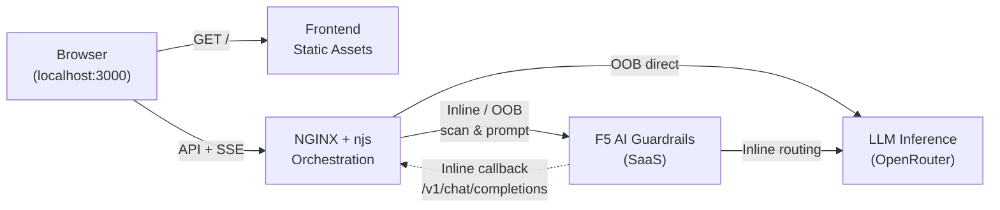

# F5 AI Guardrails Demo

Interactive demo platform for **F5 AI Guardrails** — an AI runtime security solution that inspects, evaluates, and optionally blocks LLM prompts and responses before they reach end users.

## Quick Overview

- Single-page demo UI for testing prompts against F5 AI Guardrails
- Supports both **Inline** and **Out-of-Band (OOB)** guardrail flows
- Uses **NGINX + njs** as the browser-facing orchestration layer
- Visualizes the pipeline in real time through **Server-Sent Events (SSE)**
- Returns scanner results, verdicts, model response content, and raw JSON in one place

## What It Does

- **Inline Mode** — the prompt goes through Guardrails, which evaluates it and routes it to the LLM. The UI shows each stage in real time.
- **Out-of-Band (OOB) Mode** — the prompt is pre-scanned first. If allowed, NGINX forwards it directly to the LLM. A toggle in the UI controls whether flagged prompts (review/warning) are also blocked before reaching the LLM.

Both modes show the verdict, scanner breakdown, and the full request/response payload.

### Inline Mode


### OOB Mode


## Architecture

Two containers:

| Container | Role | Port |
|-----------|------|------|
| **Frontend** | Static file server (Node.js + `serve`) | 3000 |
| **NGINX** | API proxy + SSE orchestration (nginx + njs) | 8080 |



## Prerequisites

- [Docker](https://docs.docker.com/get-docker/) and Docker Compose (included with Docker Desktop)
- A valid F5 AI Guardrails **Project ID** and **API Token**
- (Optional) An [OpenRouter](https://openrouter.ai/) API key — required for OOB mode

## Quick Start

### 1. Clone the repository

```bash
git clone https://github.com/JoshanFan/f5aigr-demo.git
cd f5aigr-demo
```

### 2. Create a `.env` file with your credentials

```bash
cat > .env << 'EOF'
DEMO_PROJECT_ID=project-app-xxxxxxxx
DEMO_API_TOKEN=your_guardrails_bearer_token
EOF
```

Replace the values above with your actual Project ID and API Token. These will be prefilled in the demo UI so you don't have to enter them manually.

### 3. Start the containers

```bash
docker compose up -d --build
```

### 4. Verify everything is running

```bash
# Check container status
docker compose ps

# Check NGINX health
curl -i http://localhost:8080/healthz
# Expected: HTTP/1.1 200 OK
```

### 5. Open the demo

Open **http://localhost:3000** in your browser.

- Log in with the default credentials: `admin` / `F5aidemo`
- The **Project ID** and **API Token** should already be prefilled from your `.env`
- Click **Save** in Settings and wait for the status to show **Connected**
- Choose **Inline** or **OOB** mode, enter a prompt, and click **Send**

> **Note:** In Inline mode, the flow animation for steps 3–4 (LLM proxy) will be incomplete when running locally, because Guardrails SaaS cannot call back into `localhost`. The scan results and verdicts are unaffected — only the animation is partial. For the full flow animation, deploy the demo on a publicly reachable environment.

### Stop the demo

```bash
docker compose down
```

## Configuration

### Credentials

You can enter or change credentials in the Settings panel at any time. Values saved in the browser override the `.env` prefills.

For OOB mode, you also need to fill in the **OpenRouter API Key** and **Model** in Settings.

### API Base URL

The default `docker-compose.yml` sets `API_BASE_URL=http://localhost:8080`, so the frontend talks directly to the NGINX container.

If `API_BASE_URL` is empty, the frontend auto-derives it from the current origin (e.g. `http://localhost:3000` → `http://localhost:3000/api`). This is useful for production deployments where a reverse proxy sits in front.

## Demo Usage

1. Log in (default: `admin` / `F5aidemo`)
2. Choose **Inline** or **OOB** mode
3. Enter or select a prompt
4. Click **Send**
5. Watch the real-time flow animation
6. Review the verdict, scanner breakdown, and raw JSON

## Repository Layout

| File | Description |
|------|-------------|
| `index.html`, `styles.css`, `app.js` | Single-page frontend |
| `auth-utils.js` | Demo login validation |
| `scan-utils.js` | Guardrails response mapping and scanner labels |
| `runtime-config.js.template` | Template for runtime environment injection |
| `nginx/default.conf.template` | NGINX proxy and SSE configuration |
| `nginx/orchestrator.js` | njs orchestration logic |
| `Dockerfile.frontend` | Frontend container image |
| `Dockerfile.nginx` | NGINX container image |
| `docker-compose.yml` | Local development setup |

## Development

### Run tests

```bash
node --test auth-utils.test.js scan-utils.test.js nginx/orchestrator.test.js dockerfile-assets.test.js login-performance.test.js logout-feature.test.js
node --test runtime-prefill.test.js adversarial-samples.test.js
```

### Syntax checks

```bash
node --check app.js
node --check nginx/orchestrator.js
```

### Rebuild after changes

```bash
docker compose up -d --build --force-recreate
```

## Deployment Notes

This repository does not assume any single deployment platform. For a public deployment:

- the frontend is served on a public origin
- `/api/*` is routed to the NGINX container
- the `/api` prefix is stripped before traffic reaches NGINX

In many deployments, `API_BASE_URL` can be left empty if the reverse proxy exposes NGINX at `/api` on the same host as the frontend.

## Troubleshooting

| Problem | What to check |
|---------|---------------|
| Health check fails | Both containers running? Ports `3000`/`8080` free? Check `docker compose logs` |
| "Disconnected" status | Correct Project ID / API Token? `API Base URL` pointing to NGINX, not frontend? |
| `API 404` or HTML response | Request hitting wrong route — verify reverse proxy strips `/api` prefix |
| Inline mode hangs | Guardrails can reach your public `/v1/chat/completions`? Check NGINX logs |
| Request timeout | Upstream timeout in logs? Proxy re-enabling buffering? Outbound network access? |

## Security Notes

- The login gate is for demo purposes only — not production access control
- `DEMO_API_TOKEN` is exposed in `runtime-config.js` — do not use a production token
- Tokens are stored in `sessionStorage` (current tab only)
- Keep `.env` local and never commit real credentials
- Rotate demo credentials before sharing externally

## Known Limitations

- Guardrails upstream is hardcoded to `https://us1.calypsoai.app`
- Session state is browser-tab scoped, not server-side
- Demo-oriented — not designed for production multi-tenant use
- No RBAC, audit log, or backend credential vault

For detailed technical internals, see `NOTES.md` (local only, not tracked in git).
